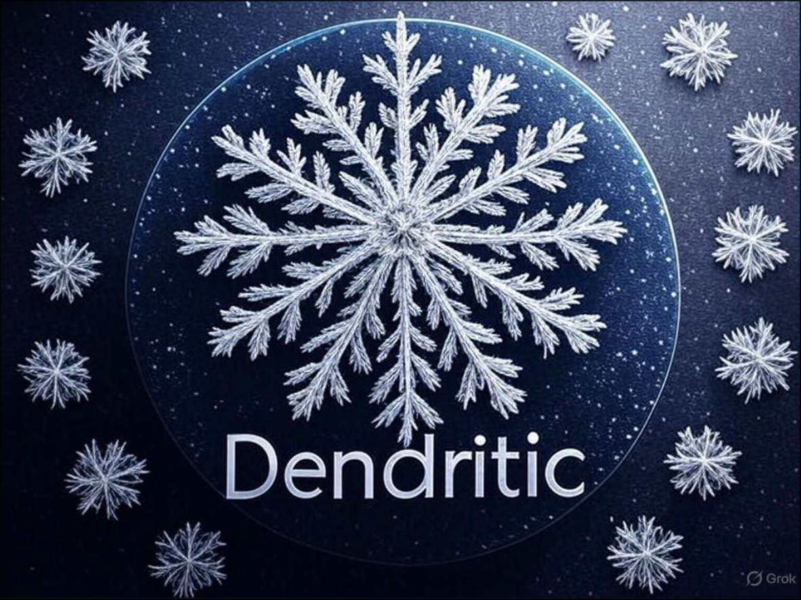

# The Dendritic Pattern with flake-parts

--[dendretic repo](https://github.com/mightyiam/dendritic)

In the early days of Flakes, users often ended up with a massive, monolithic
`flake.nix` or a spaghetti-like web of manual imports. The Dendritic (Tree-like)
Pattern solves this by treating your filesystem as the source of truth, using
`flake-parts` as the nervous system that routes code to the correct outputs.

## Flake-Parts

IMO the `flake-parts` docs could do a lot better at explaining how to use it to
configure your system. I'll attempt to explain how to use it and why you might
want to.

While `flake-parts` provides the core structure for standard flake outputs, its
real power lies in its modular ecosystem. You can plug in opinionated modules to
instantly add specialized features to your system's nervous system.

- When people say "top-level flake attribute", they mean putting your
  configuration inside the `flake = { ... };` block.

### The "Top-Level" (`flake`):

This is for things that are **global** and don't change regardless of whether
you're on a Mac, PC or ARM server.

- Example: Your `nixosConfigurations` or `homeConfigurations`.

- A NixOS configuration for a specific laptop is a single, static definition. It
  doesn't need to be "multiplied" by system types.

## The "Per-System" (`perSystem`)

- `perSystem` is for things that must be built for a specific architecture.
  (e.g., `devShells`, `packages`, `formatter`)
  - You can't run an `x86_64` version of `helix` on an `aarch64` (ARM) MacBook.

- Our `nixosConfigurations` don't live in a system specific attribute so it goes
  under `flake` instead of `perSystem`.

You can place everything in the same file:

```nix
outputs = inputs@{ flake-parts, ... }:
  # https://flake.parts/module-arguments.html
  flake-parts.lib.mkFlake { inherit inputs; } (top@{ config, withSystem, moduleWithSystem, ... }: {
    imports = [
      # Optional: use external flake logic, e.g.
      # inputs.foo.flakeModules.default
    ];
    flake = {
      # Put your original flake attributes here.
    };
    systems = [
      # systems for which you want to build the `perSystem` attributes
      "x86_64-linux"
      # ...
    ];
    perSystem = { config, pkgs, ... }: {
      # Recommended: move all package definitions here.
      # e.g. (assuming you have a nixpkgs input)
      # packages.foo = pkgs.callPackage ./foo/package.nix { };
      # packages.bar = pkgs.callPackage ./bar/package.nix {
      #   foo = config.packages.foo;
      # };
    };
  });
```

Or you can break it down into modules:

```nix
{
  inputs = {
    nixpkgs.url = "github:nixos/nixpkgs/nixos-unstable";
    flake-parts.url = "github:hercules-ci/flake-parts";
  };

  outputs = inputs @ { flake-parts, ... }:
    flake-parts.lib.mkFlake { inherit inputs; }
    {
      # Supported Systems
      systems = [ "x86_64-linux" "x86_64-darwin"];
      imports = [ ./devShell.nix ./package.nix ./nixos.nix ]
    };

}
```

`devShell.nix`:

```nix
{
  perSystem = { pkgs, ...}: {
  devShells.default = pkgs.mkShell {
    packages = [ pkgs.ripgrep pkgs.fd ];
  };
};
}
```

`package.nix`:

```nix
{
  perSystem = { pkgs, ...}: {
    packages.myPackage = pkgs.myPackage;
  };
}
```

## Getting Started

This is the flake that I'm currently using to slowly adopt the dendritic
pattern, or not if I choose not to. Maybe making every single thing a flake
output isn't necessary or the best idea, we'll see. With this, you can use both
regular NixOS/home-manager modules and NixOS/home-manager flake-parts modules.

**Scalability Toggle**:

- I have `++ (builtins.attrValues ...)` set for both home-manager and NixOS
  where it automatically adds the inputs for files in the `~/flake/parts`
  directory. This is fine for personal use where you want the custom modules
  available everywhere instantly.

- If the flake gets too big and you want more control just comment out those 2
  lines in the `nixos.nix` and start explicitly adding the `inputs` to your
  `imports` list. Now the `parts/` directory will act like a library rather than
  a Registry, you manually pick what you want for each host.

- [home-manager flake-parts module](https://nix-community.github.io/home-manager/index.xhtml#sec-flakes-flake-parts-module)

Example: Let's call this `~/flake/flake.nix`

```nix
# In this example the top-level configuration is a [`flake-parts`](https://flake.parts) one.
# Therefore, every Nix file (other than this) is a flake-parts module.
# https://github.com/mightyiam/dendritic/blob/master/example/flake.nix
{
  # Declares flake inputs
  inputs = {
    flake-parts = {
      url = "github:hercules-ci/flake-parts";
      inputs.nixpkgs-lib.follows = "nixpkgs";
    };

    import-tree.url = "github:vic/import-tree";

    nixpkgs.url = "github:nixos/nixpkgs/25.11";
  };

  outputs =
    inputs:
    inputs.flake-parts.lib.mkFlake { inherit inputs; } {
      # This tells flake-parts which systems to generate outputs for
      systems = import inputs.systems;

      imports = [
        # Optional: use external flake logic, e.g.
        inputs.treefmt-nix.flakeModule
        # Import home-manager's flake module
        # The flake module defines flake.homeModules and flake.homeConfigurations options,
        # allowing them to be properly merged if they are defined in multiple modules
        inputs.home-manager.flakeModules.default
        ./nixos.nix
      ]
      ++ (inputs.import-tree ./parts).imports;

      hosts = {
        magic = {
          username = "jr";
          system = "x86_64-linux";
        };
        # Adding a second machine is now 4 lines of code:
        # secondary = { username = "jr"; system = "aarch64-linux"; };
      };

      perSystem =
        {
          system,
          ...
        }:
        {

          # Access pkgs with your specific config
          _module.args.pkgs = import inputs.nixpkgs {
            inherit system;
            config.allowUnfree = false;
          };
        };

    };
}
```

> `import-tree` is essentially a "smarter" version of the `scanPaths` function
> that we'll see later specifically designed for `flake-parts`. It ensures that
> every file in `./parts` is treated as a module that the `mkFlake` engine can
> digest.

Note, this example has more code than for example the dendritic nix repo has
because it enables you to automatically import `flake-parts` modules as well as
standard NixOS and home-manager modules as you move to the new system/pattern.

And `~/flake/nixos.nix`:

```nix
/**
  System Configuration Factory Module

  This module defines a custom schema for describing multiple NixOS hosts
  and automatically generates the corresponding `nixosConfigurations` flakes output.
*/
{
  inputs,
  self,
  lib,
  config,
  ...
}:
let
  # Internal Library & Module Imports

  # Initialize a custom library using the project's internal lib and nixpkgs
  myLib = import "${self}/lib/default.nix" { inherit (inputs.nixpkgs) lib; };

  # Import entry points for global NixOS and Home Manager shared modules
  # `self` points to the root of the flake (requires passing `self` throuth specialArgs)
  nixosModules = import "${self}/nixos";
  homeManagerModules = import "${self}/home";

  # Shared Binary Cache Configuration
  caches = {
    nix.settings = {
      builders-use-substitutes = true;
      substituters = [ "https://cache.nixos.org" ];
      trusted-public-keys = [ "cache.nixos.org-1:6NCHdD59X431o0gWypbMrAURkbJ16ZPMQFGspcDShjY=" ];
    };
  };
in
{
  /**
    SCHEMA DEFINITION
    Defines the 'hosts' option, allowing us to declare system metadata
    (e.g., username, architecture) in a structured attribute set.
  */
  options.hosts = lib.mkOption {
    description = "An attribute set of host definitions to be generated.";
    type = lib.types.attrsOf (
      lib.types.submodule {
        options = {
          username = lib.mkOption {
            type = lib.types.str;
            default = "jr";
            description = "Primary user account name for this host.";
          };
          system = lib.mkOption {
            type = lib.types.str;
            default = "x86_64-linux";
            description = "The target system architecture.";
          };
        };
      }
    );
  };
  /**
    CONFIGURATION GENERATION
    Iterates through the 'config.hosts' defined above and maps them to
    actual 'nixosSystem' instances for the Flake output.
  */
  config.flake.nixosConfigurations = lib.mapAttrs (
    host: cfg:
    inputs.nixpkgs.lib.nixosSystem {
      # Pass global context and metadata into the module system
      specialArgs = {
        inherit
          inputs
          self
          host
          myLib
          ;
        inherit (cfg) username;
      };

      modules = [
        # 1. Project-wide NixOS logic
        nixosModules

        # 2. Host-specific hardware/system configuration file
        "${self}/hosts/${host}/configuration.nix"

        # 3. Home Manager NixOS module (allows configuring HM within NixOS)
        inputs.home-manager.nixosModules.home-manager

        # 4. Standardized cache settings defined in 'let' block
        caches

        # 5. Inline configuration for system-specific and user-specific settings
        {
          nixpkgs.hostPlatform = cfg.system;
          home-manager = {
            # By default, Home Manager uses a private pkgs instance that is configured
            #  via the home-manager.users.<name>.nixpkgs options. To instead use the
            #  global pkgs that is configured via the system level nixpkgs options, set
            useGlobalPkgs = true;
            # Install packages to /etc/profiles rather than $HOME/.nix-profile
            useUserPackages = true;
            # Dynamically import the user's home configuration based on host/username
            users.${cfg.username} = {
              imports = [
                (import "${self}/hosts/${host}/home.nix")
              ]
              # Automatically import `homeModules` in `./parts`
              # Comment out if you want to be explicit and add
              # e.g., inputs.self.homeModules.helix
              ++ (builtins.attrValues config.flake.homeModules);
            };

            extraSpecialArgs = {
              inherit
                inputs
                homeManagerModules
                myLib
                host
                ;
              inherit (cfg) username;
            };
          };
        }
      ]
      # Automatically import `nixosModules` in `./parts`
      ++ (builtins.attrValues config.flake.nixosModules);
    }
  ) config.hosts;
}
```

Now, any `flake-parts` module that we place in the `~/flake/parts/` directory
will be automatically imported with `import-tree`. The key here is that it has
to be a `flake-parts` module, i.e. wrapped in `flake` or `perSystem`, etc.

You can place both NixOS modules and home-manager modules in the `~/flake/parts`
directory. Just import it to the correct location and you're good.

Example NixOS module for amd drivers `~/flake/parts/amd-drivers.nix`:

```nix
{
  flake.nixosModules.amd-drivers =
    {
      lib,
      pkgs,
      config,
      ...
    }:
    with lib;
    let
      cfg = config.custom.amd-drivers;
    in
    {
      options.custom.amd-drivers.enable = mkEnableOption "AMD GPU/CPU optimized for AM06 Pro";

      config = mkIf cfg.enable {
        # Modern ROCm/HIP support
        systemd.tmpfiles.rules = [ "L+ /opt/rocm/hip - - - - ${pkgs.rocmPackages.clr}" ];
        services.xserver.videoDrivers = [ "amdgpu" ];

        hardware = {
          amdgpu.initrd.enable = true;

          graphics = {
            enable = true;
            enable32Bit = true;
            extraPackages = with pkgs; [
              rocmPackages.clr.icd # For OpenCL/Compute
              # Hardware Acceleration (Video Encoding/Decoding)
              libva
              libva-utils
              libva-vdpau-driver
              libvdpau-va-gl
            ];
          };

          cpu.amd.updateMicrocode = true;
        };

        boot = {
          kernelModules = [
            "kvm-amd"
            "amdgpu"
          ];
          kernelParams = [
            "amd_pstate=active" # Best for Ryzen 5000+ power management
          ];
        };

        boot.kernelPackages = pkgs.linuxPackages_latest;
      };
    };
}
```


Now, to enable this module, I'll add this to my `configuration.nix` or
equivalent:

```nix
 {...}: {
  imports = [
        # Not necessary because of the `++ (builtins.attrValues config.flake.nixosModules)` in nixos.nix
        # for more control remove those lines and explicitly add:
        # inputs.self.nixosModules.amd-drivers
  ];

  custom = {
    amd-drivers.enable = true;
  };
}
# ---snip---
```

---

Example home-manager module `~/flake/parts/fzf.nix`:

```nix
{
  flake.homeModules.fzf =
    { lib, config, ... }:
    let
      cfg = config.custom.fzf;
    in
    {
      options.custom.fzf.enable = lib.mkEnableOption "Enable fzf module";

      config = lib.mkIf cfg.enable {
        programs.fzf = {
          enable = true;
          # colors = lib.mkForce { };

          defaultOptions = [
            "--height 40%"
            "--reverse"
            "--border"
            "--color=16"
          ];

          defaultCommand = "rg --files --hidden --glob=!.git/";
        };
      };
    };
}
```

And enable with `custom.fzf.enable = true;` in your `home.nix` or equivalent.

And this will be automatically imported, same as above but because of the added
`++ (builtins.attrValues config.flake.homeModules);` in `nixos.nix`. Without
the automatic import, add `inputs.self.homeModules.fzf` to your `imports` list
in your `home.nix` or equivalent.

If you don't like the auto-import behavior, just delete or comment out that
line, after that, the `import` statements become necessary.

---

<details>
<summary>Example of a module thats both NixOS and home-manager zsh.nix </summary>

`~/flake/parts/shells/zsh.nix`:

```nix
{
  flake.nixosModules.zsh =
    {
      pkgs,
      lib,
      config,
      username,
      ...
    }:
    let
      cfg = config.custom.zsh;
    in
    {
      options.custom.zsh = {
        enable = lib.mkEnableOption "User zsh configuration";
      };

      config = lib.mkIf cfg.enable {

        # 1. NixOS System-Level (The "Foundation")
        programs.zsh.enable = true;
        users.defaultUserShell = pkgs.zsh;
        environment.pathsToLink = [ "/share/zsh" ]; # Fixes completion for system packages

        # 2. Home Manager (User Configuration)
        home-manager.users.${username} = {
          programs.zsh = {
            enable = true;
            enableCompletion = true;
            completionInit = "autoload -U compinit && compinit";
            autosuggestion.enable = true;
            syntaxHighlighting.enable = true;
            oh-my-zsh = {
              package = pkgs.oh-my-zsh;
              enable = true;
              plugins = [
                "git"
                "sudo"
                "rust"
                "fzf"
              ];
            };
            profileExtra = ''
              if [ -z "$DISPLAY" ] && [ "$XDG_VTNR" = 1 ]; then
               exec mango
              fi
              # ---snip----
}
```

> NOTE: Passing `username` through `specialArgs` is what makes this bridge work,
> you can also just use your username.

This is what `~/flake/parts/shells/default.nix` looks like, I had to explicitly
add `myLib` in a `let` statement to prevent infinite recursion:

```nix
{ lib, ... }:
let
  # prevents infinite recursion error
  myLib = import ../../lib { inherit lib; };
in
{
  # Now we can use it safely
  imports = myLib.scanPaths ./.;
}
```

Enable it in `configuration.nix` or equivalent:

```nix
custom.zsh.enable = true;
```

`lib/default.nix` is just a function that automatically imports any `.nix` file,
skipping `default.nix`:

<details>
<summary> `lib/default.nix` </summary>

```nix
{ lib, ... }:
{
  # Returns a list of all .nix files and directories in a path,
  # skipping default.nix. Perfect for the 'imports' list.
  scanPaths =
    path:
    let
      content = builtins.readDir path;
    in
    map (name: path + "/${name}") (
      builtins.attrNames (
        lib.filterAttrs (
          name: type: (type == "directory") || (name != "default.nix" && lib.hasSuffix ".nix" name)
        ) content
      )
    );

  relativeToRoot = lib.path.append ../.;
}
```

</details>

The key here is wrapping the home-manager logic in
`home-manager.users.${username} = {}`, this effectively creates a home-manager
sandbox enabling configuration of both in the same file.

> NOTE: You can do this without `flake-parts` also but often wasn't recommended
> because the files become a mess that's hard to understand.

</details>

---

# Example using perSystem

In the `flake.nix`, notice the `inputs.treefmt-nix.flakeModule`. Since a
formatter is something that you would want to run on every system, you use the
`perSystem` attribute.

Adding the `inputs.treefmt-nix.flakeModule` makes the `treefmt` options
available

`~/flake/parts/treefmt.nix`:

```nix
{
  perSystem = _: {
    treefmt = {
      projectRootFile = "flake.nix";

      programs = {
        deadnix.enable = true;
        statix.enable = true;
        keep-sorted.enable = true;
        nixfmt = {
          enable = true;
          # package = pkgs.nixfmt;
        };
      };

      settings = {
        global.excludes = [
          "LICENSE"
          "README.md"
          ".adr-dir"
          "nu_scripts"
          "*.{gif,png,svg,tape,mts,lock,mod,sum,toml,env,envrc,gitignore,sql,conf,pem,key,pub,py,narHash}"
          "Cargo.lock"
          "flake.lock"
          "justfile"
          ".jj/*"
        ];

        formatter = {
          nixfmt.priority = 1;
          statix.priority = 2;
          deadnix.priority = 3;
        };
      };
    };
  };
}
```

> By using `perSystem`, your `treefmt` configuration is automatically available
> for every architecture you support (x86, ARM, etc.), allowing you to run
> `nix fmt` on any machine without rewriting the logic.

`import-tree` automatically imports this because it's a `flake-parts` module &
flake output.

---

# flake-parts & numtide devshells

Adding this flake input and `flakeModule` make the options available, they're
similar to NixOS's `devShell` but not the same:

```nix
devshell.url = "github:numtide/devshell";
```

`~/flake/parts/dev-shell.nix`:

```nix
{
  perSystem =
    { pkgs, system, ... }:
    {
      devshells.default = {
        name = "nixos-dev";

        packages = with pkgs; [
          nixfmt
          deadnix
          nixd
          nil
          nh
          nix-diff
          nix-tree
          helix
          git
          ripgrep
          jq
          tree
        ];

        # Message of the Day
        motd = ''
          {2}── NixOS Dev Shell ──────────────────────────────────────────{reset}
          {9}  System: {reset} ${system}
          {2}──────────────────────────────────────────────────────────────{reset}
        '';

        commands = [
          {
            name = "rebuild";
            package = "nh";
            help = "Run nh os switch on the current flake";
            command = "nh os switch .";
          }
          {
            name = "fmt";
            package = "nixfmt";
            help = "Format all nix files in the project";
            command = "nix fmt";
          }
        ];
      };
    };
}
```

Enter devShell:

```bash
cd ~/flake
nix develop
```
