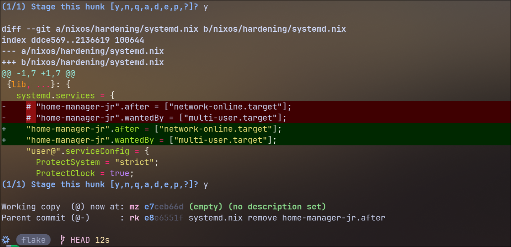

# Version Control with JJ

<details>
<summary> ✔️ Click to Expand Table of Contents</summary>

<!-- toc -->

</details>


<div style="font-size: 0.8em; margin-top: 10px;">
  **Image Source:** This image is from the [Jujutsu VCS repository](https://github.com/jj-vcs/jj) and is licensed under the Apache 2.0 License.
</div>

⚠️ **Security Reminder**: Never commit secrets (passwords, API keys, tokens,
etc.) in plain text to your Git repository. If you plan to publish your NixOS
configuration, always use a secrets management tool like `sops-nix` or `agenix`
to keep sensitive data safe. See the
[Sops-Nix Guide](https://saylesss88.github.io/installation/enc/sops-nix.html)
for details.

## Getting Started

Jujutsu (jj) is a modern, Git-compatible version control system designed to
simplify and improve the developer experience. It offers a new approach to
distributed version control, focusing on a more intuitive workflow, powerful
undo capabilities, and a branchless model that reduces common pitfalls of Git.

**Recommended resources**:

- [Steve's Jujutsu Tutorial](https://steveklabnik.github.io/jujutsu-tutorial/)
  (most up to date). Steve does an excellent job explaining the ins and outs of
  Jujutsu.

- [zerowidth jj-tips-and-tricks](https://zerowidth.com/2025/jj-tips-and-tricks/)

- Official:

```bash
jj help -k tutorial
```

- Every time you run a `jj` command, it examines the working copy and takes a
  snapshot.

- Command help:

```bash
jj <command> --help
jj git init --help
jj git push --help
```

## 🔑 Key Concepts

<details>
<summary> ✔️ Click to Expand Key Concepts </summary>

1. **Working Copy as Commit**

- In JJ your working copy is always a real commit. Any changes you make are
  automatically recorded in this working commit. The working copy is always
  (`@`) and the Parent commit is always `(@-)` keep this in mind.

- There is **no staging area** (index) as in Git. You do not need to run
  `git add` or `git commit` for every change. Modifications are always tracked
  in the current commit.

2. **Branchless Workflow and Bookmarks**

- JJ does not have the concept of a "current branch." Instead, use bookmarks,
  which are named pointers to specific commits.

- Bookmarks do not move automatically. Commands like `jj new` and `jj commit`
  move the working copy, but the bookmark stays were it was. Use
  `jj bookmark move` to move bookmarks. (e.g., `jj bookmark move main`). You can
  also use `jj bookmark set main -r @` to explicitly set the main bookmark to
  point at the working copy commit.

- Only commits referenced by bookmarks are pushed to remotes, preventing
  accidental sharing of unfinished work.

3. **Automatic Tracking and Simpler Workflow**

To stop tracking a specific file, first add it to your `.gitignore`, then run
`jj untrack <file>`

- The working copy acts as a live snapshot of your workspace. Commands first
  sync filesystem changes into this commit, then perform the requested
  operation, and finally update the working copy if needed.

4. Operation Log and Undo

- JJ records every operation (commits, merges, rebases, etc.) in an **operation
  log**. Inspect it with: `jj op log`

- You can view and undo any previous operation, not just the most recent one,
  making it easy to recover from mistakes, a feature not present in Git’s core
  CLI.

5. First-Class Conflict Handling

Conflicts happen when JJ can't figure out how to merge different changes made to
the same file.

- Conflicts are stored inside commits, not just in the working directory. You
  can resolve them at any time, not just during a merge or rebase.

- Conflict markers are inserted directly into files, and JJ can reconstruct the
  conflict state from these markers. You can resolve conflicts by editing the
  files or using `jj resolve`.

6. Revsets and Filesets

- **Revsets**: JJ's powerful query language for selecting sets of commits,
  inspired by Mercurial. For example, `jj log -r "author(alice) & file(*.py)"`
  lists all commits by Alice that touch Python files.

- **Filesets**:JJ supports a functional language for selecting sets of files,
  allowing advanced file-based queries and operations.

| Feature              | Git                      | Jujutsu (jj)                                |
| :------------------- | :----------------------- | :------------------------------------------ |
| Staging Area         | Yes (git add/index)      | No, working copy is always a commit         |
| Commit Workflow      | Stage → Commit           | All changes auto-recorded in working commit |
| Branches             | Central to workflow      | Optional, bookmarks used for sharing        |
| Undo/Redo            | Limited, complex         | Easy, operation log for undo                |
| Conflict Handling    | Manual, can be confusing | Conflicts tracked in commits, easier to fix |
| Integration with Git | Native                   | Fully compatible, can switch back anytime   |

7. Anonymous branches: In Git a branch is a pointer to a commit that needs a
   name.

If you haven't taken the time to deep dive Git, it may be a good time to learn
about a new way of doing Version Control that is actually less complex and
easier to mentally map out in my opinion.

Jujutsu is a new front-end to Git, and it's a new design for distributed version
control. --jj init

You can use jujutsu (jj) with existing Git repositories with one command.
`jj git init --colocate` or `jj git init --git-repo /path/to/git_repository`.
The native repository format for jj is still a work in progress so people
typically use a `git` repository for backend.

Unlike `git`, `jj` has no index "staging area". It treats the working copy as an
actual commit. When you make changes to files, these changes are automatically
recorded to the working commit. There's no need to explicitly stage changes
because they are already part of the commit that represents your current working
state.

</details>

**Simplified Workflow**

Check where you're at, JJ doesn't care about commits without descriptions but
Git and GitHub do:

```bash
❯  jj st
The working copy has no changes.
Working copy  (@) : n a8b19ca2 (empty) (no description set)
Parent commit (@-): k 8c487558 edit(jj): ui.color = always diff.format color-words
```

We can see that the Working copy is `(empty)` and has `(no description set)`,
lets give it a description:

```bash
❯  jj desc -m "chore: nix flake update"
Working copy  (@) now at: n 5c36a33d (empty) chore: nix flake update
Parent commit (@-)      : k 8c487558 edit(jj): ui.color = always diff.format color-words
```

I ran `nix flake update`, let's check our status:

```bash
❯  jj st
Working copy changes:
M flake.lock
Working copy  (@) : n d54ab019 chore: nix flake update
Parent commit (@-): k 8c487558 edit(jj): ui.color = always diff.format color-words
```

- We can see that running `nix flake update` modified `M` our `flake.lock`. To
  finalize this change we can run `jj new`.

```bash
❯  jj new
Working copy  (@) now at: v cad9d50b (empty) (no description set)
Parent commit (@-)      : n d54ab019 chore: nix flake update
```

Now, looking at the output of `jj new` above, we can see that the Working copy
is empty and has no description set. If we want to push these changes to GitHub,
we have to point the `main` bookmark where the changes exist, the Parent commit
in this case:

```bash
❯  jj bookmark set main -r @-
Moved 1 bookmarks to n d54ab019 main* | chore: nix flake update
```

- Notice the `main*`, the `*` indicates that our local `main` has changes that
  `main@origin` does not have.

Ok, our `main` bookmark is now pointing at our latest changes. We can now run
`jj git push` to push them to the remote and make them a part of the permanent
record:

```bash
❯  jj git push
Changes to push to origin:
  Move forward bookmark main from 3956b1386d0a to d54ab0197bef
git: Enumerating objects: 14, done.
git: Counting objects: 100% (14/14), done.
git: Delta compression using up to 16 threads
git: Compressing objects: 100% (10/10), done.
git: Writing objects: 100% (10/10), 1.52 KiB | 520.00 KiB/s, done.
git: Total 10 (delta 7), reused 0 (delta 0), pack-reused 0 (from 0)
remote: Resolving deltas: 100% (7/7), completed with 4 local objects.
```

Success! Let's check out our status again:

```bash
❯  jj st
The working copy has no changes.
Working copy  (@) : v cad9d50b (empty) (no description set)
Parent commit (@-): n d54ab019 main | chore: nix flake update
```

- Notice that `main*` is now just `main`, indicating our local and remotes are
  in sync!

Let's check out the log:

```bash
❯  jj log
@  v sayls8@proton.me 2026-03-22 12:35:34 5835b760
│  (no description set)
◆  n sayls8@proton.me 2026-03-22 12:26:20 main d54ab019
│  chore: nix flake update
~
```

- The `◆` indicates that change `n` is now immutable after the push. Since it is
  now immutable, `jj` automatically creates a new change on top of `main` and
  moves the working copy to it.

This is the hardest part for most people to grasp so let's try another example
where this time we push changes from the working copy.

I'll add a simple `README.md` to our flake root:

```bash
❯ touch README.md


❯  jj st
Working copy changes:
A README.md
Working copy  (@) : v 5835b760 (no description set)
Parent commit (@-): n d54ab019 main | chore: nix flake update
```

Let's give the change a description. Remember that `jj` commands default to the
working copy, so `jj desc` is the same is `jj desc -r @`

```bash
❯  jj desc -m "chore: add README"
Working copy  (@) now at: v cdbb489f chore: add README
Parent commit (@-)      : n d54ab019 main | chore: nix flake update
```

Now rather than finalizing the current change with `jj new`, we will just point
the `main` bookmark at the working copy `@` and then push.

```bash
❯  jj bookmark set main -r @
Moved 1 bookmarks to v cdbb489f main* | chore: add README

  flake   HEAD [!]
❯  jj git push
Changes to push to origin:
  Move forward bookmark main from d54ab0197bef to cdbb489fecc0
  git: Enumerating objects: 4, done.
  git: Counting objects: 100% (4/4), done.
  git: Delta compression using up to 16 threads
  git: Compressing objects: 100% (2/2), done.
  git: Writing objects: 100% (3/3), 332 bytes | 332.00 KiB/s, done.
  git: Total 3 (delta 1), reused 0 (delta 0), pack-reused 0 (from 0)
  remote: Resolving deltas: 100% (1/1), completed with 1 local object.
  Warning: The working-copy commit in workspace 'default' became immutable, so a new commit has been created on top of it.
  Working copy  (@) now at: s 51306e16 (empty) (no description set)
  Parent commit (@-)      : v cdbb489f main | chore: add README
```

With jujutsu, most commands allow you to pass `-r`/`--revision`

## What is the Jujutsu Working Copy

<details>
<summary> ✔️ Click To Expand Working Copy Description </summary>

`@` is a revset for "whichever commit the working copy reflects". Think of `@`
as where you are currently making changes.

Every time you run a `jj` command, it examines the working copy (the files on
disk) and takes a snapshot. --Steves JJ Tutorial

Let's version control an existing nix development environment.

```bash
cd projects/rust

❯  ls
 flake.lock   flake.nix

jj git init --colocate
Initialized repo in "."
Hint: Running `git clean -xdf` will remove `.jj/`!
```

```bash
❯  jj log
@  t sayls8@proton.me 2026-03-15 08:49:21 e8fd7ee0
│  (no description set)
◆  z root() 00000000
```

Let's give this change a description:

```bash
 jj desc -m "Initial commit of dev environment"
Working copy  (@) now at: t d671f27c Initial commit of dev environment
Parent commit (@-)      : z 00000000 (empty) (no description set)

❯  jj log
# The change ID stays the same, but the commit ID changes
@  t sayls8@proton.me 2026-03-15 09:04:17 d671f27c
│  Initial commit of dev environment
◆  z root() 00000000
```

Ok, I'm done with that change. Let's start a new one, based off of `t`:

```bash
jj new
Working copy  (@) now at: q a3f5afe8 (empty) (no description set)
Parent commit (@-)      : t d671f27c Initial commit of dev environment

jj log
@  q sayls8@proton.me 2026-03-15 09:10:46 a3f5afe8
│  (empty) (no description set)
○  t sayls8@proton.me 2026-03-15 09:04:17 d671f27c
│  Initial commit of dev environment
◆  z root() 00000000
```

Since the repo wasn't an existing git repo there are no existing branches
(bookmarks). To share our work we'll want to create a branch:

Above is a repo that was just created with `jj git init --colocate`. Notice that
there is already 2 changes with change IDs `t` & `z` and 2 commits with
identifiers `e8fd7ee0` & `00000000`.

Every `jj` repo has a root commit with `zzzzzzzz` `00000000 ` identifiers.
`The diamond `◆` represents an immutable, protected revision. This is the
foundation of the repo. Jujutsu created a second change based on top of the
empty root commit.

The **working copy** in Jujutsu is an actual **commit** that represents the
current state of the files you're working on. Unlike Git, where the working copy
is separate from commits and changes must be explicitly staged and committed, in
JJ the working copy is a live commit that automatically records changes as you
modify files.

Adding or removing files in the working copy implicitly tracks or untracks them
without needing explicit commands like `git add`

The working copy commit acts as a snapshot of your current workspace. When you
run commands, Jujutsu first syncs the filesystem changes into this commit, then
performs the requested operation, and finally updates the working copy if needed

To finalize your current changes and start a new set of changes, you use the
`jj new` command, which creates a new working-copy commit on top of the current
one. This replaces the traditional Git workflow of staging and committing
changes separately.

Conflicts in the working copy are represented by inserting conflict markers
directly into the files. Jujutsu tracks the conflicting parts and can
reconstruct the conflict state from these markers. You resolve conflicts by
editing these markers and then committing the resolution in the working copy

- This means that you don't need to worry about making a change, running
  `git add .`, running `git commit -m "commit message"` because it's already
  done for you. This is handy with flakes by preventing a "dirty working tree"
  and can instantly be rebuilt after making a change.

</details>

## Example JJ Module

<details>
<summary> ✔️ Click to Expand JJ home-manager module example </summary>

- For `lazygit` fans, Nixpkgs has `lazyjj`. I've seen that it's recommended to
  use jj with `meld`. I'll share my `jj.nix` here for an example:

- I got a lot of the aliases and such from the
  [zerowidth](https://zerowidth.com/2025/jj-tips-and-tricks/) post, this has
  been a game changer:

```nix
{
  lib,
  config,
  pkgs,
  # userVars ? {},
  #
  #
  #
  ...
}: let
  cfg = config.custom.jj;
in {
  options.custom.jj = {
    enable = lib.mkOption {
      type = lib.types.bool;
      default = true;
      description = "Enable the Jujutsu (jj) module";
    };

    userName = lib.mkOption {
      type = lib.types.nullOr lib.types.str;
      default = "sayls8";
      description = "Jujutsu user name";
    };

    userEmail = lib.mkOption {
      type = lib.types.nullOr lib.types.str;
      default = "sayls8@proton.me";
      description = "Jujutsu user email";
    };

    packages = lib.mkOption {
      type = lib.types.listOf lib.types.package;
      default = with pkgs; [lazyjj meld];
      description = "Additional Jujutsu-related packages to install";
    };

    settings = lib.mkOption {
      type = lib.types.attrs;
      default = {
        ui = {
          # default-command = "log-recent";
          default-command = ["status" "--no-pager"];
          diff-editor = "gitpatch";
          # diff-editor = ["nvim" "-c" "DiffEditor" "$left" "$right" "$output"];
          # diff-formatter = ["meld" "$left" "$right"];
          merge-editor = ":builtin";
          conflict-marker-style = "diff";
        };
        git = {
          # remove the need for `--allow-new` when pushing new bookmarks
          auto-local-bookmark = true;
          push-new-bookmarks = true;
        };
        revset-aliases = {
          "closest_bookmark(to)" = "heads(::to & bookmarks())";
          "immutable_heads()" = "builtin_immutable_heads() | remote_bookmarks()";
          # The following command is incorrect, TODO
          # "default()" = "coalesce(trunk(),root())::present(@) | ancestors(visible_heads() & recent(), 2)";
          "recent()" = "committer_date(after:'1 month ago')";
          trunk = "main@origin";
        };
        template-aliases = {
          "format_short_change_id(id)" = "id.shortest()";
        };
        merge-tools.gitpatch = {
          program = "sh";
          edit-args = [
            "-c"
            ''
              set -eu
              rm -f "$right/JJ-INSTRUCTIONS"
              git -C "$left" init -q
              git -C "$left" add -A
              git -C "$left" commit -q -m baseline --allow-empty
              mv "$left/.git" "$right"
              git -C "$right" add --intent-to-add -A
              git -C "$right" add -p
              git -C "$right" diff-index --quiet --cached HEAD && { echo "No changes done, aborting split."; exit 1; }
              git -C "$right" commit -q -m split
              git -C "$right" restore . # undo changes in modified files
              git -C "$right" reset .   # undo --intent-to-add
              git -C "$right" clean -q -df # remove untracked files
            ''
          ];
        };
        aliases = {
          c = ["commit"];
          ci = ["commit" "--interactive"];
          e = ["edit"];
          i = ["git" "init" "--colocate"];
          tug = ["bookmark" "move" "--from" "closest_bookmark(@-)" "--to" "@-"];
          log-recent = ["log" "-r" "default() & recent()"];
          nb = ["bookmark" "create" "-r" "@-"]; # new bookmark
          upmain = ["bookmark" "set" "main"];
          squash-desc = ["squash" "::@" "-d" "@"];
          rebase-main = ["rebase" "-d" "main"];
          amend = ["describe" "-m"];
          pushall = ["git" "push" "--all"];
          push = ["git" "push" "--allow-new"];
          pull = ["git" "fetch"];
          dmain = ["diff" "-r" "main"];
          l = ["log" "-T" "builtin_log_compact"];
          lf = ["log" "-r" "all()"];
          r = ["rebase"];
          s = ["squash"];
          si = ["squash" "--interactive"];
        };
        revsets = {
          # log = "main@origin";
          # log = "master@origin";
        };
      };
      description = "Jujutsu configuration settings";
    };
  };

  config = lib.mkIf cfg.enable {
    home.packages = cfg.packages;

    programs.jujutsu = {
      enable = true;
      settings = lib.mergeAttrs cfg.settings {
        user = {
          name = cfg.userName;
          email = cfg.userEmail;
        };
      };
    };
  };
}
```

In my `home.nix` I have this to enable it:

```nix
custom = {
    jj = {
        enable = true;
        userName = "sayls8";
        userEmail = "sayls8@proton.me";
        packages = "";
    };
};
```

</details>

The `custom.jj` module allows me to override the username, email, packages, and
whether jj is enabled from a single, centralized place within my Nix
configuration. So only if jj is enabled, `lazyjj` and `meld` will be installed.

With the above `gitpatch` setup, say you did more work than you want to commit
which is common with jj since it automatically tracks everything. I can now run:

```bash
jj commit -i
```

And an interactive diff will come up allowing you to choose what to include in
the current commit. This also works for `jj split -i` and `jj squash -i`.

Example, using `jj commit -i`:



You can also use the `jj tug` command to make pushing to a remote more
straightforward. Since JJ's bookmarks don't automatically move as they do with
Git, you can use `jj tug` after you've made a few commits to move the bookmark
that is closest to the parent commit of your current position to your current
commit:

```bash
jj tug
jj git push
```

The `tug` alias works for both the squash and edit workflows. After running
`jj tug`, `jj git push` should work. If you get an error saying no bookmarks to
move, you can run `jj new` and then run `jj tug`, this happens when the bookmark
is already at the parent commit.

```nix
# jj.nix
mb = ["bookmark" "set" "-r" "@"];
```

Another option would be to run `jj mb main` before running `jj git push` in this
situation, but you will have to describe the commit first.

## Issues I've Noticed


I have run into a few issues, such as every flake command reloading every single
input every time. **What I mean by this is what you see when you run a flake
command for the first time, it adds all of your flakes inputs.** I believe the
fix for this is deleting and regenerating your `flake.lock`. The same thing can
happen when you move your flake from one location to another.

JJ doesn't seem to automatically track completely new files, running
`git add /file/path.nix` enables JJ to start tracking the new file.

That said, I recommend doing just that after running something like
`jj git init --colocate`. Delete your `flake.lock` and run `nix flake update`,
`nix flake lock --recreate-lock-file` still works but is being depreciated.

Sometimes the auto staging doesn't pick up the changes in your configuration so
rebuilding changes nothing, this has been more rare but happens occasionally.

One of the most fundamental differences between Jujutsu and Git is how pushing
works. If you’re coming from Git, it’s important to understand this shift so you
don’t get tripped up by “nothing happened” warnings or missing changes on your
remote.

- In Git, you're always "on" a branch (e.g., `main`).

- When you make a commit, the branch pointer automatically moves forward.

- `git push` pushes the current branch's new commits to the remote.

- If you forget to switch branches, you might accidentally push to the wrong
  place, but you rarely have to think about "moving" the branch pointer
  yourself.

**The JJ Push Model**

- JJ has no concept of a "currrent branch"

- Bookmarks **do not** move automatically. When you make a new commit, the
  bookmark (e.g., `main`) stays where it was. You must explicitly move it to
  your new commit with `jj bookmark set main` (or create a new one).

- JJ only pushes commits that are referenced by bookmarks. If your latest work
  isn't pointed to by a bookmark, `jj git push` will do nothing and warn you.
  This is to prevent accidental pushes and gives you more control over what gets
  shared.

**Typical JJ Push Workflow**

1. Check out where your working copy and Parent commit are, you will notice that
   jj highlights the minimal amount of characters needed to reference this
   change:

```bash
jj st
Working copy changes:
M README.md
Working copy  (@) : mnkrokmt 7f0558f8 say hello and goodbye
Parent commit (@-): ywyvxrts 986d16f5 main | test3
```

```bash

```

Being more explicit about your commands ensures both you and jj know where
everything should go. (i.e. `jj desc @ -m` explicitly describes `@`, the working
copy.) This will save you some headaches.

Our new change, the Working copy is now built off of `main`. The working copy
will always be (`@`).

Make some changes

```bash
jj st
Working copy changes:
A dev/flake.lock
A dev/flake.nix
Working copy  (@) : kxwrsmmu 42b011cd Add a devShell
Parent commit (@-): ywyvxrts 986d16f5 main | test3
```

Now I'm done, and since we built this change on top of `main` the following
command will tell jj we know what we want to push:

```bash
jj bookmark set main
jj git push
```

If you forget to move a bookmark, JJ will warn you and nothing will be pushed.
This is a safety feature, not a bug. That's what the `mb` alias does, moves the
bookmark to the working copy.

```nix
# home-manager alias (move bookmark)
mb = ["bookmark" "set" "-r" "@"];
```

If you really have problems, `jj git push --change @` explicitly pushes the
working copy.

This is a bit different than Git and takes some getting used to but you don't
need to move the bookmark after every commit, just when you want to push. I know
I've made the mistake of pushing to the wrong branch before this should prevent
that.

## Here's an example of using JJ in an existing Git repo

Say I have my configuration flake in the `~/flakes/` directory that is an
existing Git repository. To use JJ as the front-end I could do something like:

```bash
cd ~/flakes
jj git init --colocate
Done importing changes from the underlying Git repo.
Setting the revset alias `trunk()` to `main@origin`
Initialized repo in "."
```

- By default, JJ defines `trunk()` as the main development branch of your remote
  repository. This is usually set to `main@origin`, but could be named something
  else. This means that whenever you use `trunk()` in JJ commands, it will
  resolve to the latest commit on `main@origin`. This makes it easier to refer
  to the main branch in scripts and commands without hardcoding the branch name.

**Bookmarks** in jj are named pointers to specific revisions, similar to
branches in Git. When you first run `jj git init --colocate` in a git repo, you
will likely get a Hint saying "Run the following command to keep local bookmarks
updated on future pulls".:

```bash
jj bookmark list
track main@origin

jj st
The working copy has no changes.
Working copy  (@) : qzxomtxq 925eca75 (empty) (no description set)
Parent commit (@-): qnpnrklz bf291074 main | notes
```

This shows that running `jj git init --colocate` automatically started tracking
`main` in this case. If it doesn't, use `jj bookmark track main@origin`.

I'll create a simple change in the `README.md`:

```bash
jj st
Working copy changes:
M README.md
Working copy  (@) : qzxomtxq b963dff0 (no description set)
Parent commit (@-): qnpnrklz bf291074 main | notes
```

We can see that the working copy now contains a modified file `M README.md` and
has no description set. Lets give it a description before pushing to github.

```bash
jj desc @ -m "Added to README"
jj bookmark set main -r @
Moved 1 bookmarks to pxwnopqo 1e6e08a2 main* | Added to README
```

`jj bookmark set main -r @` moves the `main` bookmark to the current revision
(the working copy), which is the explicit, recommended way to update bookmarks
in JJ. Without this step, your bookmark will continue to point at the old
commit, not your latest work. This is a major difference from Git.

And finally push to GitHub:

```bash
jj git push
Changes to push to origin:
  Move forward bookmark main from bf291074125e to e2a75e45237b
remote: Resolving deltas: 100% (1/1), completed with 1 local object.
Warning: The working-copy commit in workspace 'default' became immutable, so a new commit has been created on top of it.
Working copy  (@) now at: pxwnopqo 8311444b (empty) (no description set)
Parent commit (@-)      : qzxomtxq e2a75e45 main | Added to README
```

---

## Create a Repo without an existing Git Repo

**Or** to do this in a directory that isn't already a git repo you can do
something like:

```bash
cargo new hello-world --vcs=none
cd hello-world
jj git init
Initialized repo in "."
```

---

### JJ and Git Side by Side

Or for example, with Git if you wanted to move to a different branch before
running `nix flake update` to see if it introduced errors before merging with
your main branch, you could do something like:

```bash
git checkout -b update-test

nix flake update

sudo nixos-rebuild test --flake .
```

If you're satisfied you can merge:

```bash
git checkout main
git add . # Stage the change
git commit -m "update"
git merge update-test
git branch -D update-test
sudo nixos-rebuild switch --flake .
```

With JJ a similar workflow could be:

1. Run `jj st` to see what you have:

```bash
jj st
The working copy has no changes.
Working copy  (@) : ttkstzzn 3f55c42c (empty) (no description set)
Parent commit (@-): wppknozq e3558ef5 main@origin | jj diff
```

If you don't have a description set for the working copy set it now.

```bash
jj desc @ -m "enable vim"
jj st
The working copy has no changes.
Working copy  (@) : ttkstzzn 63fda123 (empty) enable vim
Parent commit (@-): wppknozq e3558ef5 main@origin | jj diff
```

2. Start from the working copy (which is mutable). The working copy in JJ is
   itself a commit that you can edit and squash changes into. Since `main` is
   immutable, you can create your new change by working on top of the working
   copy commit.

Create a new change off of the working copy:

```bash
jj new @
```

3. Make your edits:

```bash
jj st
Working copy changes:
M home/editors/vim.nix
Working copy  (@) : qrsxltmt 494b5f18 (no description set)
Parent commit (@-): wytnnnto a07e775c (empty) enable vim
```

4. Squash your changes into the new change:

```bash
jj squash
The working copy has no changes.
Working copy  (@) : tmlwppnu ba06bb99 (empty) (no description set)
Parent commit (@-): wytnnnto 52928ed9 enable vim
```

This moves your working copy changes into the new commit you just created.

5. Describe the new change, this might feel weird but the `jj squash` command
   created a new commit that you have to describe again:

```bash
jj desc @ -m "Enabled Vim"
Working copy  (@) : tmlwppnu 5c1569c3 (empty) Enabled Vim
Parent commit (@-): wytnnnto 52928ed9 enable vim
```

6. Set the bookmark to the Parent commit that was squashed into:

```bash
jj bookmark set wyt
```

7. Finally Push to the remote repository:

```bash
jj git push --allow-new
Changes to push to origin:
  Add bookmark wyt to 5c1569c35b22
remote: Resolving deltas: 100% (4/4), completed with 4 local objects.
remote:
remote: Create a pull request for 'wyt' on GitHub by visiting:
remote:      https://github.com/sayls8/flake/pull/new/wyt
remote:
```

This command does the following:

- Uploads your bookmark and the associated commit to the remote repository
  (e.g., GitHub).

- If the bookmark is new (not present on the remote), `--allow-new` tells JJ
  it’s okay to create it remotely.

- After pushing, GitHub (or your code host) will usually suggest creating a pull
  request for your new branch/bookmark, allowing you or your collaborators to
  review and merge the change into main.

**Merging your Change into `main`**

Option 1. Go to the URL suggested in the output, visit in this case:

```bash
https://github.com/sayls8/flake/pull/new/wyt
```

- Click Create PR

- Click Merge PR if it shows it can merge cleanly.

Option 2.

1. Switch to `main` (if not already there):

```bash
jj bookmark set main
```

2. Create a new change that combines the new change with `main`:

```bash
jj new tml wyt -m "Merge: enable vim"
```

This creates a new commit with both `tml` and `wyt` as parents, which is how JJ
handles merges (since `jj merge` depreciated). JJ merges are additive and
history-preserving by design especially for folks used to Git's fast-forward and
squash options.

---

### Summary

- With `jj` you're creating a new commit rather than a new branch.

- Amending vs. Squashing: Git's `git commit --amend` updates the last commit.
  `jj squash` combines the current commit with its parent, effectively doing the
  same thing in terms of history.

- Merging: Git's merge command is explicit. In `jj`, the concept is similar, but
  since there's no branch, you're "merging" by moving your working commit to
  include these changes.

- No need to delete branches: Since there are no branches in `jj`, there's no
  equivalent to `git branch -D` to clean up. Instead commits that are no longer
  needed can be "abandoned" with `jj abandon` if you want to clean up your
  commit graph.

- `jj describe` without a flag just opens `$EDITOR` where you can write your
  commit message save and exit.

- In `git`, we finish a set of changes to our code by committing, but in `jj` we
  start new work by creating a change, and _then_ make changes to our code. It's
  more useful to write an initial description of your intended changes, and then
  refine it as you work, than it is creating a commit message after the fact.

- I have heard that jj can struggle with big repositories such as Nixpkgs and
  have noticed some issues here and there when using with NixOS. I'm hoping that
  as the project matures, it gets better on this front.

---

## The 2 main JJ Workflows

### The Squash Workflow

This workflow is the most similar to Git and Git's index.

The workflow:

1. Describe the work we want to do with `jj desc -m "message"`

2. We create a new empty change on top of that one with `jj new`

3. When we are done with a feature, we run `jj squash` to move the changes from
   `@` into the change we described in step 1. `@` is where your working copy is
   positioned currently.

For example, let's say we just ran `jj git init --colocate` in our configuration
Flake directory making it a `jj` repo as well using git for backend.

```bash
cd flake
jj git init --colocate
jj log
@  lnmmxwko sayls8@proton.me 2025-06-27 10:14:57 1eac6aa0
│  (empty) (no description set)
○  qnknltto sayls8@proton.me 2025-06-27 09:04:08 git_head() 5358483a
│  (empty) jj
```

The above log output shows that running `jj git init` creates an empty working
commit (`@`) on top of the `git_head()`

```bash
jj desc -m "Switch from nixVim to NVF"
jj new  # Create a new empty change
jj log
@  nmnmznmm sayls8@proton.me 2025-06-27 10:16:30 52dd7ee0
│  (empty) (no description set)
○  lnmmxwko sayls8@proton.me 2025-06-27 10:16:24 git_head() 3e8f9f3a
│  (empty) Switch from nixVim to NVF
○  qnknltto sayls8@proton.me 2025-06-27 09:04:08 5358483a
│  (empty) jj
```

The above log shows that running `jj desc` changes the current (`@`) commits
description, and then `jj new` creates a new empty commit on top of it, moving
(`@`) to this new empty commit.

The "Switch from nixVim to NVF" commit is now the parent of (`@`).

Now, we'd make the necessary changes and to add them to the commit we just
described in the previous steps.

The changes are automatically "staged" so theres no need to `git add` them, so
we just make the changes and squash them.

```bash
jj squash  # Squash the commit into its parent commit (i.e., our named commit)
jj log
@  zsxsolsq sayls8@proton.me 2025-06-27 10:18:01 2c35d83f
│  (empty) (no description set)
○  lnmmxwko sayls8@proton.me 2025-06-27 10:18:01 git_head() 485eaee9
│  (empty) Switch from nixVim to NVF
```

This shows `jj squashes` effect, it merges the changes from the current (`@`)
commit into its parent. The (`@`) then moves to this modified parent, and a new
empty commit is created on top, ready for the next set of changes.

```bash
sudo nixos-rebuild switch --flake .
```

We're still in the nameless commit and can either continue working or run
`jj desc -m ""` again describing our new change, then `jj new` and `jj squash`
it's pretty simple. The nameless commit is used as an adhoc staging area.

When you are ready to push, it's important to know where your working copy
currently is and if it's attached to a bookmark. It's common for `jj new` to
detach the head, all you have to do is tell JJ which branch to attach to, then
push:

```bash
jj st
Working copy changes:
M hosts/magic/configuration.nix
M hosts/magic/container.nix
Working copy  (@) : youptvvn 988e6fc9 (no description set)
Parent commit (@-): qlwqromx 4bb754fa mdbook container
```

The above output means that the working copy has modifications (`M`) in two
files. And these changes are not yet committed.

```bash
jj bookmark set main
jj git push
```

---

### The Edit Workflow

This workflow adds a few new commands `jj edit`, and `jj next`.

Here's the workflow:

1. Create a new change to work on the new feature with `jj new`

2. If everything works exactly as planned, we're done.

3. If we realize we want to break this big change up into multiple smaller ones,
   we do it by making a new change before the current one, swapping to it, and
   making the necessary change.

4. Lastly, we go back to the main change.

The squash workflow leaves `@` at an empty undescribed change, with this
workflow, `@` will often be on the existing change.

If `@` wasn't at an empty change, we would start this workflow with:

```bash
jj new -m "Switch from NVF to nixVim"
```

since our `@` is already at an empty change, we'll just describe it and get
started:

For this example, lets say we want to revert back to nixVim:

```bash
jj desc -m "Switch from NVF to nixVim"
jj log
@  zsxsolsq sayls8@proton.me 2025-06-27 10:18:47 606abaa7
│  (empty) Switch from NVF to nixVim
○  lnmmxwko sayls8@proton.me 2025-06-27 10:18:01 git_head() 485eaee9
│  (empty) Switch from nixVim to NVF
○  qnknltto sayls8@proton.me 2025-06-27 09:04:08 5358483a
│  (empty) jj
```

Again, this shows `jj desc` renaming the current empty `@` commit.

We make the changes, and it's pretty straightforward so we're done, every change
is automatically staged so we can just run `sudo nixos-rebuild switch --flake .`
now to apply the changes.

If we wanted to make more changes that aren't described we can use `jj new -B`
which is similar to `git add -a`.

```bash
jj new -B @ -m "Adding LSP to nixVim"
Rebased 1 descendant commits
Working copy  (@) now at: lpnxxxpo bf929946 (empty) Adding LSP to nixVim
Parent commit (@-)      : lnmmxwko 485eaee9 (empty) Switch from nixVim to NVF
```

The `-B` tells jj to create the new change _before_ the current one and it
creates a rebase. We created a change before the one we're on, it automatically
rebased our original change. This operation will _always_ succeed with jj, we
will have our working copy at the commit we've just inserted.

You can see below that `@` moved down one commit:

```bash
jj log
○  zsxsolsq sayls8@proton.me 2025-06-27 10:22:03 ad0713b6
│  (empty) Switch from NVF to nixVim
@  lpnxxxpo sayls8@proton.me 2025-06-27 10:22:03 bf929946
│  (empty) Adding LSP to nixVim
○  lnmmxwko sayls8@proton.me 2025-06-27 10:18:01 git_head() 485eaee9
│  (empty) Switch from nixVim to NVF
○  qnknltto sayls8@proton.me 2025-06-27 09:04:08 5358483a
│  (empty) jj
○  qnknltto sayls8@proton.me 2025-06-27 09:04:08 git_head()
```

The "Adding LSP to nixVim" commit is directly above "Switch from nixVim to NVF"
(the old `git_head()`)

The "Switch from NVF to nixVim" commit (which was your `@` before `jj new -B`)
is now above "Adding LSP to nixVim" in the log output, meaning "Adding LSP to
nixVim" is its new parent.

`@` has moved to "Adding LSP to nixVim"

`jj log` example output

---

## Operation Log and Undo

JJ records every operation (commits, merges, rebases, etc.) in an operation log.
You can view and undo previous operations, making it easy to recover from
mistakes, a feature not present in Git’s core CLI

```bash
jj op log
@  fbf6e626df22 jr@magic 15 minutes ago, lasted 9 milliseconds
│  new empty commit
│  args: jj new -B @ -m 'Adding LSP to nixVim'
○  bde40b7c17cf jr@magic 19 minutes ago, lasted 8 milliseconds
│  describe commit 2c35d83f75031dc582bf28b64d4af1c218177f90
│  args: jj desc -m 'Switch from NVF to nixVim'
○  3a2bfe1c0b0a jr@magic 19 minutes ago, lasted 8 milliseconds
│  squash commits into 3e8f9f3a6a58fef86906e16e9b4375afb43e73e3
│  args: jj squash
○  80abcb58dcb6 jr@magic 21 minutes ago, lasted 8 milliseconds
│  new empty commit
│  args: jj new
○  8c80314cbcd7 jr@magic 21 minutes ago, lasted 8 milliseconds
│  describe commit 1eac6aa0b88ba014785ee9c1c2ad6e2abc6206e9
│  args: jj desc -m 'Switch from nixVim to NVF'
○  44b5789cb4d1 jr@magic 22 minutes ago, lasted 6 milliseconds
│  track remote bookmark main@origin
│  args: jj bookmark track main@origin
○  dbefee04aa85 jr@magic 23 minutes ago, lasted 4 milliseconds
│  import git head
│  args: jj git init --git-repo .
```

```bash
jj op undo <operation-id>
# or
jj op restore <operation-id>
```

---

## Conflict Resolution

In JJ, conflicts live inside commits and can be resolved at any time, not just
during a merge. This makes rebasing and history editing safer and more flexible

JJ treats conflicts as first-class citizens: conflicts can exist inside commits,
not just in the working directory. This means if a merge or rebase introduces a
conflict, the conflicted state is saved in the commit itself, and you can
resolve it at any time there’s no need to resolve conflicts immediately or use
“`--continue`” commands as in Git

Here's how it works:

When you check out or create a commit with conflicts, JJ materializes the
conflicts as markers in your files (similar to Git's conflict markers)

You can resolve conflicts by editing the files to remove the markers, or by
using:

```bash
jj resolve
```

---

## Revsets

[Jujutsu Revsets](https://jj-vcs.github.io/jj/latest/revsets/)

JJ includes a powerful query language for selecting commits. For example:

```bash
jj log -r "author(alice) & file(*.py)"
```

This command lists all commits by Alice that touch Python files.

## Filesets

[Jujutsu Filesets](https://jj-vcs.github.io/jj/latest/filesets/)

Jujutsu supports a functional language for selecting a set of files. Expressions
in this language are called "filesets" (the idea comes from Mercurial). The
language consists of file patterns, operators, and functions. --JJ Docs

## Summary

Jujutsu (jj) offers a streamlined, branchless, and undo-friendly approach to
version control, fully compatible with Git but designed to be easier to use and
reason about. Its workflows, operation log, and conflict handling provide a
safer and more flexible environment for managing code changes, making it a
compelling alternative for both new and experienced developers.

---

### Resources

- [steves_jj_tutorial](https://steveklabnik.github.io/jujutsu-tutorial/)

- [jj_github](https://github.com/jj-vcs/jj)

- [official_tutorial](https://jj-vcs.github.io/jj/latest/tutorial/)

- [jj_init](https://v5.chriskrycho.com/essays/jj-init/)
