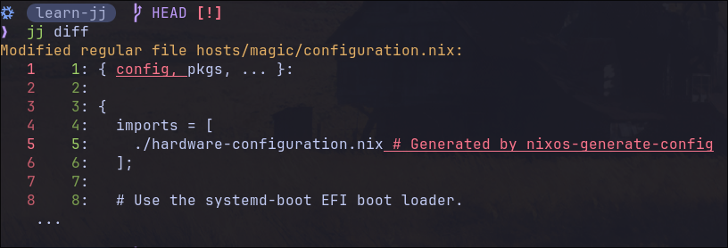

# Practical Jujutsu

This post assumes basic understanding of Git and GitHub.

I’ve spent enough time hovering between the familiarity of Git and the potential
of Jujutsu. It’s time to move past a 'primitive' workflow. By truly mastering
one of these tools, I want to turn version control from a chore into a way to
precisely navigate my development stages and build a history that future
contributors can actually follow.

JJ simplifies keeping a linear history and makes it easy to break down big
changes into smaller atomic changes.

<details>
<summary> Atomic commits & Linear History explained </summary>

1. Atomic Commits

- An atomic commit is a single unit of work that cannot be broken down further
  without losing its meaning.

- One commit should do one thing.

- If you had to "undo" that commit later, would it break unrelated features? If
  "Yes," it's not atomic.

If you find a bug, you can pinpoint the exact 10 lines of code that caused it.
In `jj`, the `split -i` and `commit -i` commands are the ultimate tools for
"atomizing" a messy afternoon of coding.

2. Linear History

A linear history is a straight line of commits without "merge bubbles" (those
criss-crossing lines you see in Git logs when people use git merge).

- Every commit has exactly one parent and one child.

- It reads like a story. You can follow the evolution of the project from bottom
  to top without getting lost in a maze of branches.

- `jj` defaults to a rebase-heavy workflow. Instead of "merging" your work and
  creating a mess, you are constantly "sliding" your changes on top of the
  latest work, keeping that line perfectly straight.

You can even insert a commit anywhere in your history with `jj new -A`
(`--insert-after`), and `jj new -B` (`--insert-before`) and JJ will rebase every
child in the history.

Use `jj show -r <revision>` to see a diff of the changes made at that Change ID,
and trivially craft it with `jj edit -r <revision>`.

</details>

Let's learn about `jj` by using it to version control a system Nix Flake.

## Quick Overview

- [Jujutsu docs Glossary](https://docs.jj-vcs.dev/latest/glossary/)

<details>
<summary>Key Terms</summary>

> "One of the first things to wrap your head around when first coming to Jujutsu
> is its approach to its revisions and revsets, i.e. “sets of revision”.
> Revisions are the fundamental elements of changes in Jujutsu, not “commits” as
> in Git. Revsets are then expressions in a functional language for selecting a
> set of revisions."
> --[Chris Krycho jj init](https://v5.chriskrycho.com/essays/jj-init/)

| Term                   | What it is                                                                                                 | Git Equivalent                        | JJ Behavior                                                               |
| ---------------------- | ---------------------------------------------------------------------------------------------------------- | ------------------------------------- | ------------------------------------------------------------------------- |
| **Working Copy (`@`)** | Your current editable commit. **Everything you do affects `@` by default.** Auto‑amends as you save files. | Untracked files + staging area + HEAD | Always a full commit. No staging. `jj st` shows changes relative to `@-`. |
| **Change ID**          | Stable ID for a logical unit of work (the `k`, `y` labels in logs). Survives edits/rebases.                | N/A                                   | Prefix like `k` or `y`. Use `jj edit k1234` to jump to any change.        |
| **Commit ID**          | Unique ID for a specific snapshot (the long hex like `41deb985`). Changes when you amend.                  | Commit hash                           | Full ID for exact snapshots. Rarely used directly.                        |
| **Bookmarks**          | Named pointers to commits (like `main`, `feature-x`). **Don't auto‑move** like Git branches.               | Branches                              | `jj bookmark set main -r @` moves it. `*` shows if local/remote match.    |
| **Parent (`@-`)**      | The commit `@` is built on top of.                                                                         | Previous commit                       | Use `-r @-` to target it. Key for squash workflow.                        |
| **Immutable (`◆`)**    | Commits that shouldn't be rewritten (pushed changes, trunk).                                               | Protected branches                    | `jj log` shows `◆`. Still editable with force flags.                      |
| **Revset**             | Query language for commits (`main..@`, `mine()`).                                                          | `git log --grep`                      | Super powerful. `jj log -r "main..@"` = changes since main.               |
| **Revision**           | "revision" is synonymous with "commit"                                                                     | Commit                                | A synonym for Commit                                                      |

**Pro tip**: `@` is **always** your current position. `jj new`, `jj desc`,
`jj squash` all default to it. **Bookmarks like `main` are just labels** - move
them explicitly with `jj bookmark set`.

</details>

See
[zerowidths jj-tips-and-tricks](https://zerowidth.com/2025/jj-tips-and-tricks/),
for a more intuitive `--interactive` workflow (The `git add -p` Hunk-wise
style).

## Getting Started

It's helpful to grasp a few Git concepts to fully understand some of the
benefits and strengths of jujutsu. I highly suggest reading
[W3Tutorials.net How to Compare Working Copy, Staging Copy, and Committed Copy of a File in Git](https://www.w3tutorials.net/blog/how-to-compare-the-working-copy-staging-copy-and-committed-copy-of-a-file-using-git/),
it covers most of the concepts that make understanding `jj` easier.

- The **Working Copy** is the version of the file you're actively editing in
  your filesystem. It's the "live" version you see in your text editor or IDE.
  --W3Tutorials.net

- [Jujutsu's Working copy commit](https://docs.jj-vcs.dev/latest/working-copy/)

> "Unlike most other VCSs, Jujutsu will automatically create commits from the
> working-copy contents when they have changed. Most `jj` commands you run will
> commit the working-copy changes if they have changed. The resulting revision
> will replace the previous working-copy revision."

In Git, `HEAD` is a pointer (usually to a branch like `main`), and that branch
points to the current commit.

In jj, the working copy `@` is itself the current commit. Bookmarks like `main`
simply point at other commits in the graph, so your working copy is often a
child of a bookmark, but it can also be off on its own.

- `❯` will indicate a command that I ran, the rest is output.

Let's start by cloning a project of mine to see how `jj` works:

```bash
❯ jj git clone git@github.com:sayls8/nix-snake.git
Fetching into new repo in "/home/jr/projects/nix-snake"
remote: Enumerating objects: 88, done.
remote: Total 88 (delta 38), reused 78 (delta 30), pack-reused 0 (from 0)
bookmark: main@origin [new] tracked
Setting the revset alias `trunk()` to `main@origin`
Working copy  (@) now at: s f143a1da (empty) (no description set)
Parent commit (@-)      : l 3b759dfe main | feat: fix clippy lints & optimize
Added 12 files, modified 0 files, removed 0 files
Hint: Running `git clean -xdf` will remove `.jj/`!
```

- We can see above that the `main@origin` bookmark is automatically tracked with
  a revset alias of `trunk()`.

> NOTE: My jj commands show the shortest possible IDs because of the setting:
>
> ```nix
> programs.jujutsu.settings = {
>    template-aliases = {
>        "format_short_change_id(id)" = "id.shortest()";
>    };
> };
> ```

Running `jj st` & `jj log`:

```bash
❯  jj st
The working copy has no changes.
Working copy  (@) : s f143a1da (empty) (no description set)
Parent commit (@-): l 3b759dfe main | feat: fix clippy lints & optimize

❯  jj log
@  s sayls8@proton.me 2026-03-21 16:31:59 f143a1da
│  (empty) (no description set)
◆  l sayls8@proton.me 2026-01-29 16:50:51 main 3b759dfe
│  feat: fix clippy lints & optimize
~
```

To show all ancestors of the most recent commit, `s` in this case:

```bash
jj log -r ::s
```

- The `@` indicates the working-copy commit. The first ID on a line (e.g. "s"
  above) is the change ID. The second ID is the commit ID ("f143a1da"). You can
  give either ID to commands that take revisions as arguments.

- `jj log` defaults to the `ui.default-revset` setting, or
  `@ | ancestors(immutable_heads().., 2) | heads(immutable_heads())` if it's not
  set. (A revset)

- `jj` commands default to operating on the working copy, `@`. `jj undo`, undoes
  your previous `jj` command. List all previous `jj` commands with `jj op log`.

In JJ, you are never "on" a branch. You are always "on" a specific change,
building a stack of changes. Until you push those changes, you can continue to
jump around and edit them with `jj edit`. Once you push those changes to a
remote, they then become immutable.

You don't have to merge `Change A` into `Change B`, because `Change B` is
already built on top of `Change A`. It inherits every line of code from the
floors below it.

In Git, the working copy is the files on disk; changes only become part of the
next commit when you stage them in the index with git add. In Jujutsu, the
working copy is the current commit: your edits live in a “working copy commit”
(`@`), which `jj` automatically updates from the files on disk, and there is no
separate staging area.

When you're ready to push to GitHub, make sure you know where your changes are.
In the example above, the working copy is empty, so to push I’d run
`jj bookmark set main -r @-` to point the `main` bookmark at the latest changes,
then `jj git push`.

- `jj git push`: By default, pushes tracking bookmarks pointing to
  `remote_bookmarks(remote=<remote>)..@`. Use `--bookmark` to push specific
  bookmarks. Use `--all` to push all bookmarks. Use `--change` to generate
  bookmark names based on the change IDs of specific commits.

If the working copy isn’t empty and those changes are what I want to push, I’d
instead run `jj bookmark set main -r @`, followed by `jj git push`. Once you
understand this distinction, the rest of the workflow feels fairly intuitive.

- `jj` is smart enough to know that: If `main` is on your Working Copy (`@`) and
  you have uncommitted changes, it pushes those.

- If your Working Copy (`@`) is empty , and `main` is on the Parent (`@-`), it
  pushes the parent.

In the above example, if I remove the `config` argument to the
`configuration.nix` and remove a few comments, then run `jj diff`:



- The `squash` workflow would benefit especially from `jj diff`. It's like
  saying "take the diff I'm looking at right now and bake it directly into the
  parent".

- A **change** is a commit that can evolve while keeping a stable identifier,
  the **change ID**.

---

## Version Control Best Practices

It's helpful to use
[Conventional Commits](https://www.conventionalcommits.org/en/v1.0.0/), a set of
rules for creating an explicit commit history.

Commit message standard syntax:

```text
<type>[optional scope]: <description>

[optional body]

[optional footer(s)]
```

Example:

```bash
feat: implement dendretic pattern for boot module
```

**Useful Utils**

- There is a new project that helps you create conventional commits for jj,
  [jj-commit](https://crates.io/crates/jj-commit).

- [commitlint-rs](https://crates.io/crates/commitlint-rs) can be used as a Git
  hook on push to enforce conventional commits.

- [semantic-release](https://github.com/semantic-release/semantic-release)
  automates the whole package release workflow.

### The edit workflow

Initialize and colocate the repository:

```bash
❯  mkdir learn-jj

  ~/projects
❯  cd learn-jj


  ~/projects/learn-jj
❯  nix flake new . -t github:nix-community/home-manager#nixos
wrote: "/home/jr/projects/learn-jj/flake.nix"

  ~/projects/learn-jj  ✗
❯  jj git init --colocate
Initialized repo in "."
Hint: Running `git clean -xdf` will remove `.jj/`!

  learn-jj   main [?]
❯  jj git remote add origin git@github.com:sayls8/learn-jj.git

  learn-j   main [?]
❯  jj bookmark create main -r @
Done importing changes from the underlying Git repo.
Created 1 bookmarks pointing to l bd3847c0 main | (no description set)

  learn-jj   refs/jj/root [!]
❯  jj bookmark track main --remote=origin
Started tracking 1 remote bookmarks.
```

Let's give it our current change a description:

```bash
❯  jj desc -m "chore: Initialize system flake"
Working copy  (@) now at: l 743b170d main* | chore: Initialize system flake
Parent commit (@-)      : z 00000000 (empty) (no description set)
```

In this example, the Parent commit is the _root commit_. The root commit is a
virtual commit at the root of every repository. It has a commit ID consisting of
all '0's (`00000000...`) and a change ID consisting of all 'z's (`zzzzzzzz...`).
It can be referred to in revsets by the function `root()`.

- With this workflow, your working copy is typically at your current change.

- JJ treats the working copy as a commit rather than having an index like Git.

If we wanted to push right now we could with `jj git push` (or equivalently
`jj git push --bookmark main`), but let's first learn a bit more about how `jj`
works.

Let's say we're done with the current change and we're ready to make it
immutable and start a new change:

```bash
❯ jj new -m "chore: change username & hostname in flake.nix"
Working copy  (@) now at: p 6524f35a (empty) chore: change username & hostname in flake.nix
Parent commit (@-)      : l 743b170d main* | chore: Initialize system flake
```

- As stated above, `jj` commands default to the working copy. So `jj new` is the
  same as `jj new -r @`. By running `jj new` repeatedly, we build a linear stack
  where each change is a child of the previous one. When we're ready to 'check
  in' our work, we don't merge; we simply move the `main` bookmark to our
  current position and push.
  - If we want to start a separate task without including our current work, we
    can run `jj new main` (or any other Change ID). This creates a sibling
    change. Our previous stack isn't "lost"; it stays exactly where it was in
    the graph, waiting to be described, rebased, or merged later.

- Now our Working copy `@` is at an `(empty)` change with the description
  "chore: change username & hostname in flake.nix".

- As you can see, running `jj new`, does not move the `main` bookmark. This is
  the hardest part to grasp when coming from Git IMO. Let's make some more
  changes to hammer this home.

I've added my hostname and username to the `flake.nix` template, let's make them
a part of the permanent record.

I create a minimal `configuration.nix`, check my status and notice that I forgot
to run `jj new -m "feat: create minimal configuration.nix"`. Let's see how to
recover from this and keep our commits atomic.

```bash
jj split -i
```

- This opens up a diff editor, I'll only press `y` for the changes related to
  username and hostname. After you pass on what you don't want in this change
  and press `y` on what you do want, your $EDITOR will open with your previous
  commit message. Save it and another commit message will open up in $EDITOR,
  this is whatever you didn't press `y` on i.e., the `configuration.nix`
  changes, just give the second set of changes a different description and
  you're all set.

Another cool thing about `jj` is that you can add a description whenever you
want. Running `jj desc -m "add configuration.nix"` doesn't finalize your commit
like it does with Git. So, you can put the description first, last, or in the
middle of a current change with no issue. The equivalent command to
`git commit -m "message"` is `jj commit -m "message" && jj new`

Let's see what the `jj split -i` command left us with:

```bash
❯  jj
Working copy changes:
A configuration.nix
Working copy  (@) : m b3cc09db feat: create minimal configuration.nix
Parent commit (@-): p cddde3b4 chore: change username & hostname in flake.nix
```

- To see a diff of the changes in the parent commit:

```bash
jj show -r @-
```

And our `log`:

```bash
❯  jj log
@  m sayles8@proton.me 2026-03-15 13:43:31 b3cc09db
│  feat: create minimal configuration.nix
○  p sayls8@proton.me 2026-03-15 13:41:19 cddde3b4
│  chore: change username & hostname in flake.nix
○  l sayls8@proton.me 2026-03-15 13:37:29 main* 743b170d
│  chore: Initialize system flake
◆  z root() 00000000
```

As you can see, `main*` is all the way back at change `l`. Let's move our `main`
bookmark to our current Working copy.

```bash
❯  jj bookmark set main -r @
Moved 1 bookmarks to m b3cc09db main* | feat: create minimal configuration.nix
```

```bash
❯  jj log
@  m sayls8@proton.me 2026-03-15 13:43:31 main* b3cc09db
│  feat: create minimal configuration.nix
○  p sayls8@proton.me 2026-03-15 13:41:19 cddde3b4
│  chore: change username & hostname in flake.nix
○  l sayls8@proton.me 2026-03-15 13:37:29 743b170d
│  chore: Initialize system flake
◆  z root() 00000000
```

```bash
❯  jj git push
Changes to push to origin:
  Add bookmark main to b3cc09dba32c
git: Enumerating objects: 9, done.
git: Counting objects: 100% (9/9), done.
git: Delta compression using up to 16 threads
git: Compressing objects: 100% (7/7), done.
git: Writing objects: 100% (9/9), 1.99 KiB | 1019.00 KiB/s, done.
git: Total 9 (delta 1), reused 0 (delta 0), pack-reused 0 (from 0)
remote: Resolving deltas: 100% (1/1), done.
Warning: The working-copy commit in workspace 'default' became immutable, so a new commit has been created on top of it.
Working copy  (@) now at: u 551e83ad (empty) (no description set)
Parent commit (@-)      : m b3cc09db main | feat: create minimal configuration.nix
```

```bash
❯  jj log
@  u sayls8@proton.me 2026-03-15 13:47:27 551e83ad
│  (empty) (no description set)
◆  m sayls8@proton.me 2026-03-15 13:43:31 main b3cc09db
│  feat: create minimal configuration.nix
```

- Notice `jj log` now shows `main` instead of `main*`, indicating that `main`
  and `origin@main` are in sync!

- Also notice the `◆` next to the `m` change, this indicates that this change is
  now immutable. This is mentioned in the output of `jj git push` above.
  - `jj` does this so you don't accidentally rewrite history that others might
    have pulled. You can still force-edit if you need to but it's `jj`s way of
    saying, "This is now part of the public record".

I now need to add a minimal `home.nix`, then run `nix flake check` to see if I
forgot anything.

If something isn't being picked up by `jj` try running `jj st` and check again.
Running any `jj` command updates the Working copy.

Since when running `jj git push` `jj` automatically creates a new commit on top
of the last one, the next step is to describe this change.

I ran `nix flake check` and needed to add a `hardware-configuration.nix`, and
`networking.hostId` required by ZFS, if I wanted to be a stickler about atomic
commits I'd run `jj split -i` again but it's fine by me to make 2 small changes
to get the flake to pass the `check`.

## The squash Workflow

The last section left me with:

```bash
❯  jj st
Working copy changes:
M configuration.nix
A flake.lock
A hardware-configuration.nix
A home.nix
Working copy  (@) : u e57a7a39 feat: add minimal home.nix
Parent commit (@-): m b3cc09db main | feat: create minimal configuration.nix
```

Let's push what we have:

```bash
❯  jj bookmark set main -r @
Moved 1 bookmarks to u e57a7a39 main* | feat: add minimal home.nix

  learn-jj   HEAD [!]
❯  jj git push
Changes to push to origin:
  Move forward bookmark main from b3cc09dba32c to e57a7a39957a
git: Enumerating objects: 8, done.
git: Counting objects: 100% (8/8), done.
git: Delta compression using up to 16 threads
git: Compressing objects: 100% (6/6), done.
git: Writing objects: 100% (6/6), 1.98 KiB | 1.98 MiB/s, done.
git: Total 6 (delta 1), reused 0 (delta 0), pack-reused 0 (from 0)
remote: Resolving deltas: 100% (1/1), completed with 1 local object.
Warning: The working-copy commit in workspace 'default' became immutable, so a new commit has been created on top of it.
Working copy  (@) now at: y 53e8a3d9 (empty) (no description set)
Parent commit (@-)      : u e57a7a39 main | feat: add minimal home.nix
```

```bash
❯  jj st
The working copy has no changes.
Working copy  (@) : y 53e8a3d9 (empty) (no description set)
Parent commit (@-): u e57a7a39 main | feat: add minimal home.nix
```

Great, just what we need, an empty change! Let's describe what we plan on doing:

```bash
jj desc -m "refactor: restructure flake to multi-host layout in hosts/magic"
```

Now we create a new change on top of this one:

```bash
❯  jj new
Working copy  (@) now at: w 43195106 (empty) (no description set)
Parent commit (@-)      : y c66bc991 (empty) refactor: restructure flake to multi-host layout in hosts/magic
```

Now we make our changes to the descriptionless Working copy and `squash` our
changes into the parent commit.

```bash
mkdir -p hosts/magic
```

```bash
jj st
The working copy has no changes.
Working copy  (@) : w 43195106 (empty) (no description set)
Parent commit (@-): y c66bc991 (empty) refactor: restructure flake to multi-host layout in hosts/magic
```

Ahh, `jj` doesn't pick up empty directories...

```bash
mv configuration.nix home.nix hosts/magic
```

```bash
 jj st
Working copy changes:
R {configuration.nix => hosts/magic/configuration.nix}
R {home.nix => hosts/magic/home.nix}
Working copy  (@) : w 8c49fc64 (no description set)
Parent commit (@-): y c66bc991 (empty) refactor: restructure flake to multi-host layout in hosts/magic
```

- `R` = Renamed. `jj` is pretty clever here. Since I moved the files but their
  contents stayed the same, `jj` detected that I didn't just "delete" one file
  and "add" a new one, I actually moved an object from point A to point B.
  - The fact that `jj` shows `R {home.nix => hosts/magic/home.nix}` means it is
    keeping the history of that file intact. If you were to look at the log for
    `hosts/magic/home.nix` later, `jj` would know to look back into the history
    of the old `home.nix` as well.

I'm happy with the changes so far:

```bash
❯  jj squash
Working copy  (@) now at: k 41deb985 (empty) (no description set)
Parent commit (@-)      : y 2bee669a refactor: restructure flake to multi-host layout in hosts/magic
```

- Notice how change `w` disappeared and `y` is no longer empty? That's because
  we squashed the changes from our Working copy into the parent commit!

### Pushing from the squash workflow

Let's look at what we have:

```bash
❯  jj st
The working copy has no changes.
Working copy  (@) : k 41deb985 (empty) (no description set)
Parent commit (@-): y 2bee669a refactor: restructure flake to multi-host layout in hosts/magic
```

Since the working copy is at an `(empty)` change, it wouldn't make sense to push
it. We have to move our bookmark to the parent commit, and then push!

```bash
❯  jj bookmark set main -r @-
Moved 1 bookmarks to y 2bee669a main* | refactor: restructure flake to multi-host layout in hosts/magic
```

```bash
❯  jj git push
Changes to push to origin:
  Move forward bookmark main from e57a7a39957a to 2bee669ac276
git: Enumerating objects: 5, done.
git: Counting objects: 100% (5/5), done.
git: Delta compression using up to 16 threads
git: Compressing objects: 100% (3/3), done.
git: Writing objects: 100% (4/4), 452 bytes | 452.00 KiB/s, done.
git: Total 4 (delta 1), reused 0 (delta 0), pack-reused 0 (from 0)
remote: Resolving deltas: 100% (1/1), completed with 1 local object.
```

This was the biggest Aha moment I had. It makes perfect sense that you wouldn't
want to push a change that changes nothing. Since we squashed the contents of
the Working copy into `@-`, that is where we need `main` to point.

I have an alias:

```nix
  la = [
    "log"
    "-r"
    "all()"
  ];
```

You can also list all commits with:

```bash
jj log -r ::
# or
jj log r 'all()'
```

Let's check out our full history so far:

```bash
❯  jj la
@  k sayls8@proton.me 2026-03-15 14:30:43 41deb985
│  (empty) (no description set)
◆  y sayls8@proton.me 2026-03-15 14:30:43 main 2bee669a
│  refactor: restructure flake to multi-host layout in hosts/magic
◆  u sayls8@proton.me 2026-03-15 14:07:28 e57a7a39
│  feat: add minimal home.nix
◆  m sayls8@proton.me 2026-03-15 13:43:31 b3cc09db
│  feat: create minimal configuration.nix
◆  p sayls8@proton.me 2026-03-15 13:41:19 cddde3b4
│  chore: change username & hostname in flake.nix
◆  l sayls8@proton.me 2026-03-15 13:37:29 743b170d
│  chore: Initialize system flake
◆  z root() 00000000
```

- Textbook linear history. Every single commit has exactly one parent, forming a
  single, unbroken chain from the `root()` up to the current working copy.

- The diamonds `◆` show that everything from `y` down is now part of the
  permanent record (pushed to the remote).

In Git, achieving this usually requires `git add`, `git commit --amend`, or an
interactive rebase. In jj, you just worked in the working copy and pushed, the
tool handled the "shaping" of the history for you.

---

## Bookmarks and Branches

Bookmarks are named pointers to revisions (just like branches are in Git). You
can move them without affecting the target revision's identity. -- Jujutsu docs

Branches are just multiple "changes" with the same parent.

List all available bookmarks

```bash
❯  jj bookmark list --all
feat1 (deleted)
  @origin: xo 9067e7b7 mangowc flake-parts module
main: s b250e6ed testing the push-on-new non working bs
  @git: s b250e6ed testing the push-on-new non working bs
  @origin (behind by 2 commits): o 65e79e4b jj bookmarks push-on-new
Hint: Bookmarks marked as deleted can be *deleted permanently* on the remote by running `jj git push --deleted`. Use `jj bookmark forget` if you don't want that.
```

Every time you run `jj git push`, `jj` automatically runs `jj new main` for you
because the working copy becomes immutable after the push.

Show heads of all anonymous branches:

```bash
jj log -r 'heads(all())'
```

To visualize an anonymous branch, Steve's Jujutsu tutorial does a great job of
displaying this:

```text

                     ┌───┐ ┌───┐
                 ┌───┤ F ◄─┤ G │
                 │   └───┘ └───┘
                 │
 ┌───┐  ┌───┐  ┌─▼─┐ ┌───┐ ┌───┐
 │ A ◄──┤ B ◄──┤ C ◄─┤ D ◄─┤ E │
 └───┘  └───┘  └───┘ └───┘ └───┘

```

Here, we'd say that `F` and `G` are two changes that are "on a branch," because
it looks like they're branching off from `D` and `E`.
[Steves Jujutsu tutorial What is a branch conceptually?](https://steveklabnik.github.io/jujutsu-tutorial/branching-merging-and-conflicts/anonymous-branches.html#what-is-a-branch-conceptually)

The above sentence confused me a bit. `F` and `G` are described as branching
"off" of the line containing `D` and `E`. However, in the literal graph
structure, they diverge from `C`.

Since `F` and `D` both point to `C`, they are "siblings". Because no other
commits point back to `E` and `G`, they are the only two heads.

In Jujutsu, a branch is just any path of commits that hasn't been merged yet.
Since E and G are both visible and unmerged, we have two "anonymous branches"
currently active.

The output of `jj log -r 'heads(all())'` with the above example, would yield:

```text
○  G
│
~
│
○  E
│
~
```

- `G` and `E` are the heads of the anonymous branches.

## Examples

Start at an empty change:

```bash
❯  jj log
@  p saylesss87@proton.me 2026-03-24 18:05:54 6469af06
│  (no description set)
```

Give the current change a description:

```bash
jj desc -m "refactor(waybar): waybar flake-parts module"
```

```bash
❯  jj log
@  p saylesss87@proton.me 2026-03-24 18:06:31 627d846c
│  refactor(waybar): waybar flake-parts module
○  yl saylesss87@proton.me 2026-03-24 17:55:00 56d13161
│  refactor(foot): foot flake-parts module
```

To create a branch we need 2 changes with the same parent, our current changes
parent is `yl` so let's make our new change off of that:

```bash
❯  jj new yl -m "chore: add better documentation to README"
Working copy  (@) now at: v 4697897a (empty) chore: add better documentation to README
Parent commit (@-)      : yl 56d13161 refactor(foot): foot flake-parts module
Added 1 files, modified 1 files, removed 1 files
```

Let's check out our log to see our anonymous branches:

```bash
❯  jj
@  v saylesss87@proton.me 2026-03-24 18:12:04 4697897a
│  (empty) chore: add better documentation to README
│ ○  p saylesss87@proton.me 2026-03-24 18:06:31 627d846c
├─╯  refactor(waybar): waybar flake-parts module
○  yl saylesss87@proton.me 2026-03-24 17:55:00 56d13161
│  refactor(foot): foot flake-parts module
```

We can see that `p` branches off from `yl`, let's make this change before
switching to the other branch.

```bash
❯  jj st
Working copy changes:
M README.md
Working copy  (@) : v 23d94e56 chore: add better documentation to README
Parent commit (@-): yl 56d13161 refactor(foot): foot flake-parts module
```

```bash
# This effectively moves the working copy to the other "branch"
❯  jj edit p
Working copy  (@) now at: p 627d846c refactor(waybar): waybar flake-parts module
Parent commit (@-)      : yl 56d13161 refactor(foot): foot flake-parts module
Added 1 files, modified 2 files, removed 1 files
```

> In Git, you `checkout` a branch name; in `jj`, you just move your working copy
> (`@`) to whichever commit you want to build on.

I've added the new flake-parts module and deleted the old home-manager style
module:

```bash
❯  jj st
Working copy changes:
D home/waybar.nix
M hosts/magic/home.nix
A parts/waybar.nix
Working copy  (@) : p 627d846c refactor(waybar): waybar flake-parts module
Parent commit (@-): yl 56d13161 refactor(foot): foot flake-parts module
```

Let's add another change on this branch to solidify these concepts:

```bash
❯  jj new -m "refactor(nh): nh flake-parts module"
Working copy  (@) now at: n ac086b55 (empty) refactor(nh): nh flake-parts module
Parent commit (@-)      : p 627d846c refactor(waybar): waybar flake-parts module
```

And our log to show that this branch has grown:

```bash
❯  jj log
@  n saylesss87@proton.me 2026-03-24 18:22:12 ac086b55
│  (empty) refactor(nh): nh flake-parts module
○  p saylesss87@proton.me 2026-03-24 18:06:31 627d846c
│  refactor(waybar): waybar flake-parts module
│ ○  v saylesss87@proton.me 2026-03-24 18:17:51 23d94e56
├─╯  chore: add better documentation to README
○  yl saylesss87@proton.me 2026-03-24 17:55:00 56d13161
│  refactor(foot): foot flake-parts module
```

Now, let's first merge the README branch into this one. We are worried about the
heads of the anonymous branches right now:

```bash
❯  jj log -r 'heads(all())'
@  n saylesss87@proton.me 2026-03-24 18:22:12 ac086b55
│  (empty) refactor(nh): nh flake-parts module
~

○  v saylesss87@proton.me 2026-03-24 18:17:51 23d94e56
│  chore: add better documentation to README
```

A merge is a new change that has more than one parent. With JJ, you make a
change with `jj new`. We can see that we need to make a change with both `n` and
`v` as parents from the log output above:

```bash
❯  jj new n v -m "feat: merge in README docs"
Working copy  (@) now at: yn a923db65 (empty) feat: merge in README docs
Parent commit (@-)      : n ac086b55 (empty) refactor(nh): nh flake-parts module
Parent commit (@-)      : v 23d94e56 chore: add better documentation to README
Added 0 files, modified 1 files, removed 0 files
```

```bash
❯  jj log
@    yn saylesss87@proton.me 2026-03-24 18:28:47 a923db65
├─╮  (empty) feat: merge in README docs
│ ○  v saylesss87@proton.me 2026-03-24 18:17:51 23d94e56
│ │  chore: add better documentation to README
○ │  n saylesss87@proton.me 2026-03-24 18:22:12 ac086b55
│ │  (empty) refactor(nh): nh flake-parts module
○ │  p saylesss87@proton.me 2026-03-24 18:06:31 627d846c
├─╯  refactor(waybar): waybar flake-parts module
○  yl saylesss87@proton.me 2026-03-24 17:55:00 56d13161
│  refactor(foot): foot flake-parts module
```

That messes up our perfectly linear history, let's rebase instead.

```bash
❯  jj undo
Undid operation: a74a45f02043 (2026-03-24 18:28:47) new empty commit
Restored to operation: 848c180f2a04 (2026-03-24 18:22:12) new empty commit
Working copy  (@) now at: n ac086b55 (empty) refactor(nh): nh flake-parts module
Parent commit (@-)      : p 627d846c refactor(waybar): waybar flake-parts module
Added 0 files, modified 1 files, removed 0 files
```

Rebase is your tool for changing the 'parent' of a commit. If you have two
parallel features (siblings) and you decide one should follow the other (linear
stack), you rebase the second feature onto the first.

```bash
❯  jj rebase -r v -o n
Rebased 1 commits to destination
```

Now our history is back to being completely linear:

```bash
❯  jj log
○  v saylesss87@proton.me 2026-03-24 18:30:36 8101b0dd
│  chore: add better documentation to README
@  n saylesss87@proton.me 2026-03-24 18:22:12 ac086b55
│  (empty) refactor(nh): nh flake-parts module
○  p saylesss87@proton.me 2026-03-24 18:06:31 627d846c
│  refactor(waybar): waybar flake-parts module
○  yl saylesss87@proton.me 2026-03-24 17:55:00 56d13161
│  refactor(foot): foot flake-parts module
```

To move a stack of changes, use `jj rebase -s [Source] -d [Destination]`. If you
want to move a feature to the very tip of your main line, destination is `main`.
If you want to chain features together, destination is the previous feature's
head.

Pay attention to where `@` is while rebasing, to continue on this linear stack
I'll have to run `jj new v`.

---

## Collaborating and opening PRs

So far all the examples assumed you are the only person touching this repo. For
collaboration (GitHub / GitLab PRs, code review, etc.), the mental model is:

- GitHub only understands _branches_ and _commits_.

- Jujutsu gives you _changes_ and _bookmarks_.

- You use `jj git push` to translate your clean JJ history into a Git branch
  that others can review.

A simple pattern that works well for feature branches and PRs:

1. Start from `main`

Make sure main is up to date and your working copy is clean:

```bash
jj git fetch
jj edit main
jj st
```

You should see an `(empty)` working copy with `main` as the parent.

2. Create a named feature branch as a bookmark

In JJ, you don’t “checkout” a branch, you create a new change and (optionally)
give it a bookmark name:

```bash
# Create a new change on top of main and start working there
jj new main -m "feat: add magic host"

# Optionally create a bookmark that GitHub will see as a branch
jj bookmark create feature/magic-host -r @
```

- `jj new main` makes a sibling of any in‑progress work and starts a fresh
  change on top of `main`.

- The bookmark `feature/magic-host` is what will become the Git branch name when
  you push.

3. Hack, split, squash as usual

Work in your normal JJ style:

```bash
# edit files
jj st
jj split -i
jj desc -m "feat: add magic host"
jj new
# more changes, more desc/split/squash, etc.
```

All of this is still local, fully mutable history.

4. Point your feature bookmark at the top of the stack

When you’re happy with the stack you want to send for review, move the bookmark
to the tip:

```bash
# If your working copy @ is the commit you want reviewed:
jj bookmark set feature/magic-host -r @

# If you used the squash workflow and @ is empty:
jj bookmark set feature/magic-host -r @-
```

Rule of thumb:

- If `jj st` shows actual changes or a non‑empty description at `@`, use `@`.

- If `@` is (empty) because you squashed into the parent, use `@-`.

5. Push to Git and open the PR

Now push just like before, but your feature bookmark will become a branch on the
remote:

```bash
jj git push
```

This will:

- Update `origin/feature/magic-host` to point at the same commit as your local
  `feature/magic-host`.

- Leave `main` alone until you explicitly move and push it.

On GitHub/GitLab:

- You’ll see a branch named `feature/magic-host`.

- Open a PR from `feature/magic-host` into `main` as usual.

6. Iterate on review feedback

If a reviewer asks for changes:

1. Come back to your feature branch stack:

```bash
jj edit feature/magic-host
```

2. Make your edits, split/squash/reword history freely.

3. Move the bookmark to the new tip and push again:

```bash
jj bookmark set feature/magic-host -r @
jj git push
```

GitHub will show the PR updating in place, but you got to reshuffle history
locally without `git rebase -i` pain.

“I just want a one‑off PR, no named bookmark”

If you don’t care about a persistent bookmark and just want a quick “one‑shot”
PR from whatever you’re currently working on:

1. Make sure your stack is in the shape you want.

2. Put main on the top of that stack:

```bash
# Working copy @ is the tip you want:
jj bookmark set main -r @
# Or equivalently `jj bookmark set main` since commands default to the working copy
jj git push
```

3. On GitHub, create the PR from your fork’s main to upstream main.

This is essentially the same pattern we already use in the “squash workflow,”
but applied with the mental model: “move the bookmark people care about (`main`
or a feature name) to the commit I want them to review, then push.”

### Workflow Considerations

You may want to change up how you work depending on your requirements...

1. The Tower Workflow (The "Dependent Stack")

You use a tower when your changes build on top of each other.

- `main` → `Feature A` → `Feature B` → `Feature C`

- Use it when you are refactoring a Nix module (Feature A), and then you need to
  use that new module to configure your desktop (Feature B). You literally
  cannot do B without A.

The Collaborative Benefit: You can push the entire stack. Your teammates see the
logical progression of your thought process. They can review "Feature A" while
you are already working on "Feature C."

2. The Sibling Workflow (`jj new main`) You use `jj new main` when you are
   working on independent ideas that have nothing to do with each other.

- How it looks: \* `main` → `Fix-Helix-Keys`
  - `main` → `Update-Nix-Channel`

  - `main` → `New-Wallpaper-Script`

When to use it: You’re in the middle of a massive system refactor, but you
suddenly notice your Helix C-p bind is broken. You don't want the Helix fix to
be "trapped" behind the refactor.

The Collaborative Benefit: Isolation. If your "System Refactor" is buggy and
takes three days to fix, you can still `jj git push` the "Helix Fix" to `main`
immediately because it’s a direct child of `main`. It isn't "waiting" for the
other commits.

**Fixing Divergent Branches**

`jj` makes it easy to fix divergent branches with `jj forget`.

As an example imagine this scenario:

1. On your Laptop: You finish a feature and jj git push. Local main and
   origin/main are now at Revision B.

2. On your Desktop: You forgot to pull. Local main is still at Revision A. You
   start hacking and create Revision C.

3. The Mess: You run `jj git fetch`. Now your Desktop sees:

- `main` (local) at C

- `main@origin` at B

- `jj` freaks out and marks the bookmark as diverged (main\*).

`jj bookmark forget main` is the "I don't want to think about it" button. It
deletes the `main*` label on your Desktop so you can just fetch the "real" one
from the Laptop/GitHub and rebase your new work (C) on top of it.

---

## Tips & Tricks

Your History is just a stack of diffs:

- `jj commit -i`: Slices a diff off your current work.

- `jj split -i`: Slices an existing diff into two.

- `jj bookmark forget`: Deletes a label that got messy.

**The Ghost Refactor**

**The Scenario**: You’re in the middle of a complex Rust feature (Change C), and
you realize a function in the base (Change A) needs to be public or renamed for
this to work.

1. `jj new A -m "quick fix"` → Creates a new "slice" right after A.

2. Make your change.

3. `jj squash` → This "melts" the fix directly into A.

---

**Use `jj describe` as a Task List**

Because `jj` doesn't require a "commit" to save work, you can use descriptions
to manage your focus.

When you start a session, create a few empty changes:

1. `jj new main -m "Update Cargo.toml"`

2. `jj new -m "Add pixel conversion logic"`

3. `jj new -m "Fix CLI output formatting"`

Now we have a roadmap. Use `jj edit` to jump into whichever task you feel like
doing. `jj` tracks the progress of each. No need to `stash` when jumping between
tasks because of the working copy commit.

---

**Breaking up your Current set of Changes into Atomic Commits: "The Atomic
Shredder" `jj split`**

Often I'll just keep working on a bug or feature until it works, not
particularly concerned about my VCS history. Let's say I spent 3 hours hacking
on a project of mine to get a feature working and I touched 10 files. It works,
but the commit is a mess.

With the `gitpatch` tool, `jj split -i` makes it simple to break down many
changes into logical "atomic commits" using a simple `y`/ `n` interface.

You can actually use both `jj commit -i` & `jj split -i` to break down changes
in `@` into smaller changes. `jj commit -i` is ergonomically tuned for "push
some current work down, leave the rest in @".

If your changes are already in `@-` (or any earlier commit):

- `jj commit -i` can't help, because it only ever operates on `@`.

- `jj split -i -r @-` (or equivalent) can be used to modify an existing commit
  in history.

**As a rule of thumb**:

- Changes in `@` → use `jj commit -i` to peel off a clean piece, and also
  `jj squash -i` to squash a subset of changes from the working copy into the
  parent commit.

- Changes in `@-` (or earlier) → use `jj split -i` to rewrite that commit
